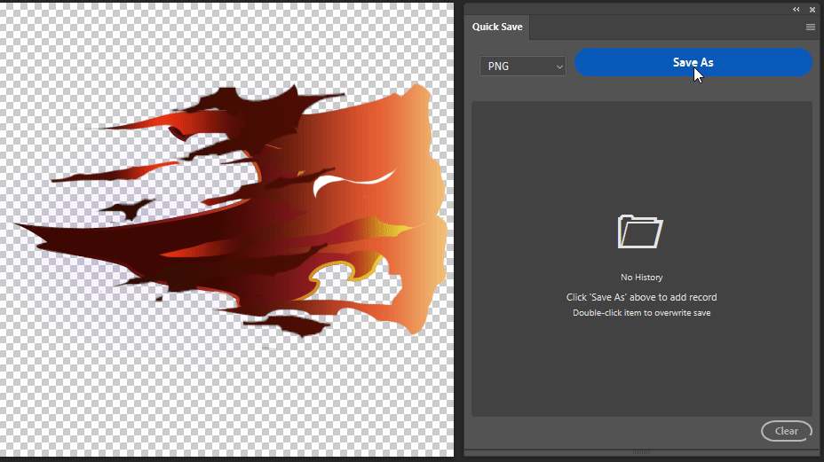

# Quick Save

[中文版 (Chinese Version)](README_CN.md)

An efficient Photoshop UXP plugin focused on quick saving and overwriting documents. It records your "Save As" history and allows you to overwrite save the current document to a history path with a simple double-click.

## ✨ Key Features

*   **💾 Save As & Record**: Save documents via the plugin's "Save As" button to automatically record file paths and thumbnails.
*   **⚡ Quick Overwrite**: **Double-click** a thumbnail in the history list to overwrite save the current open document to that location.
*   **🖼️ High-Performance Thumbnails**: Uses a local caching mechanism to generate 128x128 HD thumbnails, loading quickly without bloating document size.
*   **🌍 Multi-language Support**: Interface automatically adapts to Photoshop language settings (supports English and Simplified Chinese).
*   **🔒 Permission Management**: Smartly manages file write permissions, displaying status via visual indicators (green dot in top-left corner).
*   **🎨 Compact Interface**: Compact UI designed for professional workflows, supporting dark mode.

## 🚀 Installation

### Method 1: Double-click Install (Recommended)
1.  Get the `.ccx` installation package.
2.  Double-click the file and follow the Adobe Creative Cloud prompts to complete installation.

### Method 2: Manual Install
1.  Download this project and unzip it into a folder.
2.  Copy the entire folder to the Photoshop `Plug-ins` directory.
    *   Windows: `C:\Program Files\Adobe\Adobe Photoshop 202x\Plug-ins\`
    *   macOS: `/Applications/Adobe Photoshop 202x/Plug-ins/`
3.  Restart Photoshop.

## 📖 User Guide

### 1. Add Record
Click the **"Save As"** button at the top of the plugin panel.
*   Select save format (PNG, JPG, TGA, PSD).
*   Select save location.
*   After successful save, the file will be automatically added to the history list below.

### 2. Quick Overwrite
When you need to update the current document to a history version:
*   Find the target file in the list.
*   **Double-click** the thumbnail.
*   After confirming the prompt, the current document will directly overwrite the target file.

### 3. Manage History
*   **View Path**: Hover over the thumbnail to view the full file path.
*   **Delete Record**: Click the **"×"** button in the top-right of the thumbnail to delete a single record (and its corresponding thumbnail cache).
*   **Clear History**: Click the **"Clear"** button at the bottom to delete all records and cache.

## ⚙️ System Requirements

*   Adobe Photoshop 2021 (v22.1.0) or higher.

## 📝 Notes

*   **Overwrite is Irreversible**: Double-click overwrite save will directly replace the original file, please operate with caution.
*   **Permission Indicator**: If a green dot appears in the top-left of the thumbnail, the plugin currently has write permission for that file; if not, permission may be requested again upon overwrite.
*   **Cache Cleanup**: Deleting history records automatically cleans up the corresponding local thumbnail cache files to keep the system clean.

---
*Developed for efficient workflow.*
